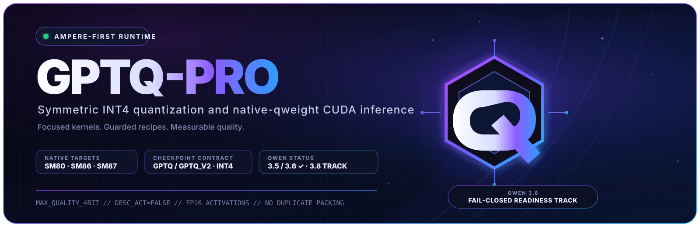

<p align="center">
  
</p>

<h1 align="center">GPTQ-Pro</h1>

<p align="center">
  <strong>Quality-first symmetric INT4 GPTQ for Ampere GPUs, with native-qweight CUDA kernels and strict architecture gates.</strong>
</p>

<p align="center">
  <a href="LICENSE"></a>
  <a href="pyproject.toml"></a>
  <a href="docs/KERNEL_V3.md"></a>
  <a href="docs/QWEN38.md"></a>
</p>

<p align="center">
  <a href="#quick-start">Quick start</a> ·
  <a href="#qwen38-27b">Qwen3.8-27B</a> ·
  <a href="#runtime-contract">Runtime contract</a> ·
  <a href="docs/KERNEL_V3.md">Kernel design</a> ·
  <a href="docs/ASSESSMENT_AND_ROADMAP.md">Roadmap</a>
</p>

> [!IMPORTANT]
> **Qwen3.8-27B is supported through its real architecture.** The official
> checkpoint reuses `model_type=qwen3_5`, `qwen3_5_text`, and
> `Qwen3_5ForConditionalGeneration`. GPTQ-Pro validates the complete 64-layer
> 27B signature and routes it through `Qwen3_5QModel`; it does not create a fake
> `qwen3_8` alias. See [`docs/QWEN38.md`](docs/QWEN38.md).

GPTQ-Pro is an experimental fork of
[ModelCloud/GPTQModel](https://github.com/ModelCloud/GPTQModel) deliberately
optimized around one path: **symmetric INT4 GPTQ on modern NVIDIA GPUs**. The
Python distribution and import names remain `GPTQModel` and `gptqmodel` for API
and checkpoint compatibility.

## Why GPTQ-Pro

| Capability | What it provides |
|---|---|
| **Ampere V3 kernel** | Specialized small-batch decode, Tensor Core prefill, and a validated shape fallback |
| **Quality-first recipes** | Group-aware reordering, MSE scale search, adaptive damping, smoothing, and GPTAQ feedback |
| **Native qweight execution** | No persistent duplicate pair-packed weight tensor |
| **Fail-closed model support** | Architecture, layer order, precision boundaries, and packed-module counts are validated |
| **RTX 3090 workflow** | Disk offload, partial-layer smoke tests, and native `sm_86` validation |

## Runtime contract

| Area | Supported |
|---|---|
| Quantization | symmetric GPTQ INT4 |
| Formats | `FORMAT.GPTQ`, `FORMAT.GPTQ_V2` |
| Runtime selectors | `BACKEND.AUTO`, `BACKEND.GPTQ_PRO` |
| GPU | Linux + NVIDIA CUDA, compute capability 8.0+ |
| Activations | FP16; other input dtypes are converted to FP16 |
| Act order | `desc_act=False` only |
| Packing | native `int32 qweight` |
| Group sizes | `-1`, `16`, `32`, `64`, `128`, `256`, `512`, `1024` |
| Shape constraints | input features divisible by 16; output features divisible by 8 |
| Adapters | LoRA on the GPTQ-Pro linear path |

ROCm, MPS, CPU inference, asymmetric weights, act-order checkpoints, native
BF16 execution, compressed-tensors W8A16, FP8, AWQ, GGUF, and non-4-bit runtime
paths are outside this fork's execution contract.

## Quick start

```bash
git clone https://github.com/groxaxo/GPTQ-Pro.git
cd GPTQ-Pro

python -m venv .venv
source .venv/bin/activate
python -m pip install --upgrade pip wheel setuptools
python -m pip install -e .
```

```python
from gptqmodel import BACKEND, GPTQModel, QuantizeConfig

qcfg = QuantizeConfig.quality_4bit(group_size=128)
qcfg.offload_to_disk = True

model = GPTQModel.load(
    "path-or-huggingface-id",
    quantize_config=qcfg,
    trust_remote_code=False,
)
model.quantize(
    ["Representative calibration text for the intended workload."],
    batch_size=1,
    backend=BACKEND.AUTO,
)
model.save("model-gptq-pro-int4")
```

Do not pass a Transformers `device_map="auto"` during quantization. GPTQ-Pro's
module loop owns placement and offload.

## Qwen3.8-27B

### Exact config preflight

```bash
python scripts/quant_qwen3_8_27b_gptqpro.py \
  --model Qwen/Qwen3.8-27B \
  --preflight-only
```

The release gate verifies:

- `Qwen3_5ForConditionalGeneration` routing;
- 64 decoder layers with 48 Gated DeltaNet and 16 full-attention layers;
- hidden size 5120 and FFN size 17408;
- one MTP layer;
- the vision-to-language projection width;
- no remote-code `auto_map`;
- exactly 400 expected GPTQ decoder linears;
- `transformers>=5.8.0`.

### Inspect the W8A16 reference first

```bash
python scripts/quant_qwen3_8_27b_gptqpro.py \
  --model lued/Qwen3.8-27B-INT8-W8A16-MTP \
  --preflight-only
```

That model is a valid Qwen3.8 architecture reference but is already
`compressed-tensors` W8A16. GPTQ-Pro will inspect it in preflight mode and will
refuse to quantize it again. Serve it with vLLM; use the official BF16 checkpoint
when producing a GPTQ-Pro artifact.

### Maximum-quality INT4 recipe

```bash
CUDA_VISIBLE_DEVICES=0,1 \
python scripts/quant_qwen3_8_27b_gptqpro.py \
  --model Qwen/Qwen3.8-27B \
  --out /models/Qwen3.8-27B-GPTQ-Pro-INT4-g64 \
  --calib text \
  --calibration-jsonl /data/qwen38-calibration.jsonl \
  --nsample 128 \
  --group-size 64 \
  --preset max_quality \
  --offload-disk
```

Start with `--layers 2` on one GPU, inspect the saved mixed-precision artifact,
and only then run all 64 layers. A complete run must produce
`qwen3_8_27b_preflight.json` with `packed_modules=400`.

### Two-3090 W8A16 deployment reference

```bash
CUDA_VISIBLE_DEVICES=0,1 vllm serve \
  lued/Qwen3.8-27B-INT8-W8A16-MTP \
  --tensor-parallel-size 2 \
  --quantization compressed-tensors \
  --language-model-only \
  --max-model-len 204800 \
  --gpu-memory-utilization 0.93 \
  --kv-cache-dtype fp8_e4m3 \
  --calculate-kv-scales \
  --enable-prefix-caching \
  --enable-chunked-prefill \
  --reasoning-parser qwen3 \
  --enable-auto-tool-choice \
  --tool-call-parser qwen3_coder \
  --disable-custom-all-reduce \
  --speculative-config '{"method":"mtp","num_speculative_tokens":3}'
```

This deployment command is documented as a reference; it does not add
compressed-tensors execution to the GPTQ-Pro kernel.

## Qwen support matrix

| Family | Status | Driver / guide |
|---|---|---|
| Qwen3.8 dense multimodal 27B | **supported** | [`quant_qwen3_8_27b_gptqpro.py`](scripts/quant_qwen3_8_27b_gptqpro.py) · [`QWEN38.md`](docs/QWEN38.md) |
| Qwen3.5 / Qwen3.6 dense multimodal 27B | supported | [`quant_qwen3_5_27b_gptqpro.py`](scripts/quant_qwen3_5_27b_gptqpro.py) |
| Qwen3.5 / Qwen3.6 flat dense text derivatives | supported | [`quant_qwen36_obliterated_gptqpro.py`](scripts/quant_qwen36_obliterated_gptqpro.py) |
| Qwen3.5 / Qwen3.6 MoE | supported | [`quant_qwen3_5_moe.py`](scripts/quant_qwen3_5_moe.py) |
| Qwen3.8-Max 2.4T | not workstation-quantizable | capacity check in [`plan_qwen38_gptqpro.py`](scripts/plan_qwen38_gptqpro.py) |

## Recipe ladder

| Preset | Use |
|---|---|
| `fast_4bit(desc_act=False)` | pipeline smoke tests |
| `quality_4bit()` | recommended time/quality balance |
| `max_quality_4bit()` | strongest named 4-bit recipe with GPTAQ feedback |
| `experimental_3bit_rotation()` | export experiment only; not executable by the local runtime |

For Qwen3.8-27B, use group 64 for the quality build and compare against a group
128 baseline before publishing. Calibration data must resemble the actual
coding, agent, tool-use, multilingual, and long-document workload.

## Ampere kernel architecture

`gptqmodel_ext/gptq_pro/` contains three dispatch paths:

1. **Fused decode (`M <= 4`)** — cooperative four-warp output tiles, native
   qweight reuse, scale residency, and deterministic split-K reduction.
2. **Tensor Core prefill** — `cp.async` staging, FP32 accumulation,
   `mma.sync.m16n8k16`, optimized tails, and vectorized FP16 stores.
3. **General fallback** — validator-backed edge-shape execution.

All paths consume the checkpoint's original `int32 qweight` directly. See
[`docs/KERNEL_V3.md`](docs/KERNEL_V3.md).

## Selective source-precision preservation

`QuantizeConfig.dynamic` accepts exact PCRE skip rules:

```python
qcfg = QuantizeConfig.max_quality_4bit(group_size=64)
qcfg.dynamic = {
    "-:^model\\.embed_tokens$": {},
    "-:^lm_head$": {},
    "-:^model\\.layers\\.0\\.mlp\\.down_proj$": {},
}
```

For Qwen3.8, norms, recurrent GDN helpers, vision modules, embeddings, LM head,
and `mtp.*` remain unquantized by the model definition. Do not use a broad
`.*gate.*` rule because it would also skip quantizable MLP `gate_proj` weights.

## Validation

```bash
python -m py_compile \
  gptqmodel/models/definitions/_qwen3_8_release.py \
  scripts/quant_qwen3_8_27b_gptqpro.py \
  tests/test_qwen3_8_27b_support.py

pytest -q \
  tests/test_qwen3_8_27b_support.py \
  tests/test_qwen3_5_27b_official.py \
  tests/models/test_qwen3_5_invariants.py \
  tests/models/test_qwen3_5_vision.py \
  tests/test_qwen3_6_support.py
```

RTX 3090 kernel validation:

```bash
bash scripts/validate_gptq_pro_ampere.sh \
  --gpu 0 --native-arch-only --require-speedup
```

A real full-model quantization, save/reload, source-vs-INT4 quality comparison,
and multimodal generation test remain mandatory before publishing a generated
checkpoint.

## Repository map

- `gptqmodel/` — loading, quantization, packing, and runtime integration;
- `gptqmodel_ext/gptq_pro/` — CUDA/C++ kernel sources;
- `scripts/` — quantization, preflight, benchmark, and validation drivers;
- `tests/` — architecture and kernel regression tests;
- `docs/KERNEL_V3.md` — V3 dispatch and numerical contract;
- `docs/QWEN38.md` — exact Qwen3.8-27B support and deployment boundary;
- `docs/ASSESSMENT_AND_ROADMAP.md` — measured status and remaining work.

## Credits and license

GPTQ-Pro remains based on the work of Qubitium, ModelCloud, the GPTQ authors,
AutoGPTQ maintainers, and the broader quantization-kernel community. See
[`CREDITS.md`](CREDITS.md). Licensed under Apache-2.0.
